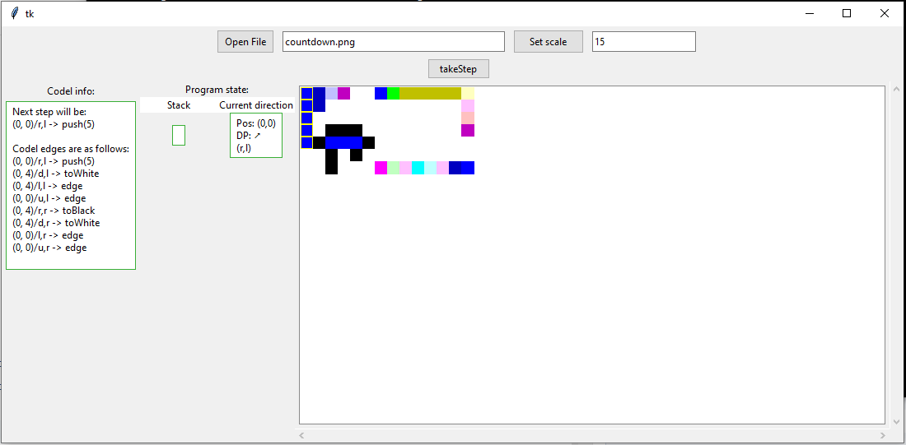

# PietInterpreter

[](https://pypi.org/project/PietInterpreter/)


[](https://www.codefactor.io/repository/github/aniondev/PietInterpreter/overview/main)
[](https://pepy.tech/project/pietinterpreter)


PietInterpreter is an interpreter for Piet-programs.
It was originally written by [Jens Bouman](https://github.com/JensBouman/Piet_interpreter).
Piet is an esoteric programming language, which is based on the geometric artist Piet Mondriaan. The language specifies actions based on the transitions of colors. For a detailed explanation, please visit [the official website](https://www.dangermouse.net/esoteric/piet.html)

## Get PietInterpreter

You can install PietInterpreter as cli-program using the command `pip3 install PietInterpreter`.

## Hints

The term `codel` was used as a synonym for color block.

## Features

This interpreter can do the following:

- Custom errors for unknown colors, unknown tokens, unknown commands and when starting in a black pixel
- Run .png images
- Run .gif images
- Output number of steps taken
- Use a Graphical User Interface:
  - Step-by-step execution of the program
    - Information about the selected codel
    - Information about the stack
    - Information about the direction
  - Visual representation of the program
  - Can open files without restarting the GUI
  - Can scale images, to better visualize the program

## Limitations

Too large images will cause the stack to overflow. The maximum size of the image is dependent on the contents.
The interpreter also can't distinguish between images with different pixel-sizes. Due to the nature of Piet, enlarging an image will cause the interpreter to produce different results

## Parameters

The main.py file in the root directory should be used to interface with the interpreter. Each parameter that can be used will be explained here.

### Help

The help parameter shows all parameters from the commandline, and can be set as follows

```sh
python main.py -h
python main.py --help
```

### File

This is a required parameter, and is a path to the image that should be interpreted. The test-images provided in the repository can be interpreted as follows:

```sh
python main.py -f Countdown.png
python main.py --file Countdown.png
```

Output:

```sh
10
9
8
7
6
5
4
3
2
1

```

### Verbose

Currently the verbose flag outputs the total amount of steps taken for the execution of the image.

```sh
python main.py --file Countdown.py -v
python main.py --file Countdown.py --verbose
```

Output:

```sh
10
9
8
7
6
5
4
3
2
1

Total steps: 276
```

### Graphical

The graphical flag opens a GUI, with the given file loaded.

```sh
python main.py --file Countdown.py -g
python main.py --file Countdown.py --graphical
```

This command should open the interface:


## Interpreter infographic


## Test programs

### Add.png

This program calculates 2+2 and output it to StdOut

### ColorError.png

This program encounters an error during lexing, and returns the full list of errors.

### Countdown.png

This program counts down from 10 to 1, outputting each number to StdOut. This program shows how turing-complete the language is by demonstrating arithmetic functionality, boolean algebra and looping/branching.

### DivideByZero.png

This program encounters a division by zero error and prints the error to StdOut

### Endless.png

This program loops endlessly, or until the stack overflows

### HelloWorld.png

Outputs Hello World! to StdOut

### StackRoll.png

This program shows the functionality behind the stackroll function. It is recommended to run this in graphical mode, to show the stack changing

## Development

### Requirements

The program requires the following libraries to be installed:

- [Python pillow](https://pillow.readthedocs.io/en/stable/), used for loading images
- [Numpy](https://numpy.org/), used for managing images
- [Pygubu](https://pypi.org/project/pygubu/), used by the GUI

Install the dependencies using:

```sh
pip3 install Pillow>=9.1.0
pip3 install numpy>=1.22.3
pip3 install pygubu>=0.20.1
```

### Development-Dependencies

Install the development-dependencies using:

```sh
pip3 install wheel
```

### Build

To Create an installable whl-package simply execute `python Setup.py bdist_wheel --dist-dir .`.

When doing this multiple times you should also clean temporary files created by python before creating the whl-package.
So to do this and install the local created package the steps are:

```sh
pip3 uninstall -y PietInterpreter
git clean -dfx
python Setup.py bdist_wheel --dist-dir .
pip3 install PietInterpreter-x.x.x-py3-none-any.whl
```

## License

See `License.txt` for license-information.
